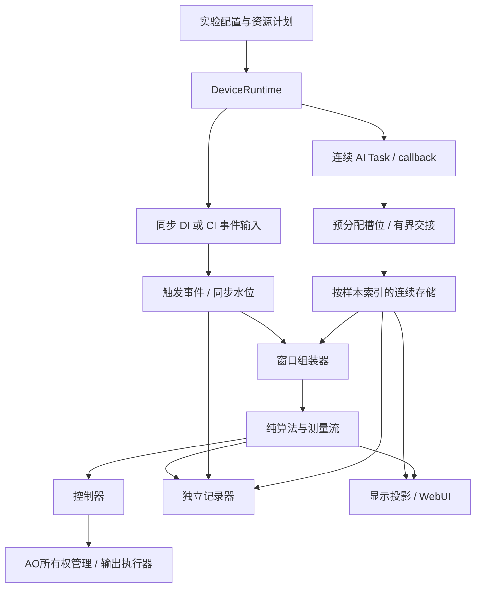

# USB-6363 采集与实验处理系统重构技术方案

版本：设计草案 v1.0  
日期：2026-09-11  
状态：供架构评审与分阶段实现；本文不是已实现功能说明。

本文以现有源码及 `daq_benchmark/` 内的实测结果为依据。所有 Python 代码块均为伪代码，接口、驱动属性及同步路由需在实现阶段核实。本文不修改现有运行程序，不要求立即移除旧系统。

## 目录

1. [目标、证据与边界](#1-目标证据与边界)
2. [架构原则与总体结构](#2-架构原则与总体结构)
3. [模块和部署边界](#3-模块和部署边界)
4. [统一配置与资源计划](#4-统一配置与资源计划)
5. [数据和时间契约](#5-数据和时间契约)
6. [采集引擎与生命周期](#6-采集引擎与生命周期)
7. [连续数据存储和内存所有权](#7-连续数据存储和内存所有权)
8. [多触发源与硬件同步](#8-多触发源与硬件同步)
9. [触发窗口与周期窗口](#9-触发窗口与周期窗口)
10. [算法和测量结果](#10-算法和测量结果)
11. [闭环控制与AO所有权](#11-闭环控制与ao所有权)
12. [记录、重放与显示](#12-记录重放与显示)
13. [接口、状态和观测](#13-接口状态和观测)
14. [容量、过载与故障](#14-容量过载与故障)
15. [迁移路线与验收](#15-迁移路线与验收)
16. [实施前决策清单](#16-实施前决策清单)

## 1. 目标、证据与边界

### 1.1 要解决的问题

- 订阅采样、直接读取、同步采帧、旧 frame stream、unified stream 有多套 AI 生命周期和数据语义。
- DAQ 读取块同时充当实验帧、算法窗口和历史缓存单位，改变读取频率会传导到业务。
- 数据转换、历史维护、统计、记录和控制相互影响，缺少明确的过载边界。
- 采样时间、主机收数时间、触发位置和业务时间戳没有统一契约。
- 多触发源、不同长度窗口、扫描和功率锁并行运行时，缺少事件路由与硬件资源所有权。
- 性能调整容易改变硬件采样率、算法窗口及统计尺度，实验结果难以比较。

### 1.2 目标使用场景

一台 USB-6363 持续采集若干 AI 通道。一个或多个外部触发源产生事件；不同事件可分别截取 1 ms、100 ms 或带预触发的数据窗口，交给不同算法。窗口可以重叠。记录、网页和控制器按各自契约消费数据。

用户目前所说的“1 ms触发采集”是采集窗口长 1 ms，不是要求每 1 ms 触发一次，也不是触发后 1 ms 内完成闭环响应。触发频率、脉宽、路数仍待确认。

### 1.3 已有性能证据

配置：Dev2，ai0/ai1/ai2，DIFF，±10 V，每通道 100 kS/s。这是测试使用的采样率。实际采样率规则为，仅有一个AI通道被启用时，采样率最大为2MS/s，两个及以上通道被启用时，采样率为多个通道均分1MS/s

| 方案 | 块长 | 返回间隔 P99 | CPU，单逻辑核100% | 说明 |
|---|---:|---:|---:|---|
| Task.read | 5 ms | 16.11 ms | 4.69% | 30秒 |
| 阻塞预分配 reader | 5 ms | 16.00 ms | 1.25% | 30秒 |
| Every-N callback + reader | 5 ms | 5.25–5.27 ms | 4.17–4.50% | 3轮，每轮300秒 |
| available轮询 | 变长，P50为171点 | 2.12 ms | 12.29% | 30秒，轮询sleep设1ms |

callback 三轮的最大返回间隔分别为 14.52、7.88、7.11 ms，均完成且没有 DAQ 错误和持续积压。每轮都是独立会话，不能称为一次不间断运行15分钟。

据此选择 `callback + AnalogMultiChannelReader + 预分配 float64` 作为初始默认驱动策略，初始读取块为每通道500点。该结论仅适用于已测配置；不承诺设备极限吞吐，不承诺严格5ms响应。

尚未验证：数据复制和队列、真实算法负载、写盘、数字输入同步、计数器事件时间戳、多触发源、AO响应、波形连续性。原 benchmark 的“completed”不能作为这些能力的认证。

### 1.4 v1范围与非目标

v1支持单设备、同一AI会话中的固定通道表和采样时钟。支持连续数据、周期窗口，以及通过验证后的外部触发窗口。AI保持采样，触发用于标记和截窗。

以下不作为v1默认能力：多设备同步、任意PFI路由、每次触发重新启动有限AI任务、硬件精确时刻AO输出、硬实时闭环、分布式消息系统。

确实需要有限/可重触发硬件采集时，另建硬件采集配置档，由同一个设备管理者管理；不能伪装成连续截窗，也不能让业务自行创建Task。

## 2. 架构原则与总体结构

### 2.1 必须成立的规则

1. 每台设备的硬件资源由一个 DeviceRuntime 管理。正常连续会话只有一个 AI Task owner；同步 DI、CI、AO 可以有独立Task，但归同一资源计划。
2. 只有 `acquisition/daqmx/` 调用 nidaqmx。这个限制不等于整个系统只能有一个Task。
3. 回调只读入预分配槽位、发布固定大小元数据和统计；不做算法、JSON、磁盘、网络、配置变更或Task关闭。
4. AI采集块、触发事件、实验窗口、算法结果、显示帧是不同类型。
5. 原始数据身份是 `session_id + sample_index + channel_id`；`frame_id`不再承担全系统时间轴。
6. 同一会话内通道顺序、单位、采样率固定。改变这些参数必须结束旧会话并创建新会话。
7. 硬件采样率由实验定义。过载不能自动降低它。显示降采样和算法重采样必须显式、可追溯。
8. 所有队列、槽位和长期缓存有容量与溢出行为；不得静默丢失要求完整的数据。
9. 同一AO通道同一时刻只有一个有效控制者，扫描、手动、闭环均遵守。
10. 启动成功、已布防、运行、停止完成、故障必须可区分；超时不等于成功停止。

### 2.2 数据流



### 2.3 控制流与数据流

控制流包括启动、停止、参数更新、AO所有权申请，采用低频命令与状态查询。数据流包括原始块、事件、窗口和测量，采用有界传递接口。

控制请求不能持有内部数据锁执行HTTP、文件写入或长时间DAQ调用。网页查询只读快照，不能间接执行采集、算法或硬件配置。

## 3. 模块和部署边界

### 3.1 建议目录

新目录暂定 `daq_app/`，避免迁移中与旧 `usb6363/` 含混并存。

```text
daq_app/
  app.py                       # 组合模块、服务入口
  contracts/
    config.py                  # 严格配置、单位、版本
    data.py                    # Block / Event / Window / Measurement
    faults.py                  # 错误码及传播策略
  acquisition/
    runtime.py                 # 设备生命周期唯一入口
    resource_plan.py           # AI/DI/CI/AO/端子资源分配
    engine.py                  # AI读取策略和回调门控
    slot_pool.py               # 有界槽位及所有权
    daqmx/
      capabilities.py          # 能力查询、路由验证
      ai.py
      trigger.py
      ao.py
  stream/
    sample_store.py            # 连续NumPy环形缓冲
    event_store.py             # 有界事件保留、来源序号
    window_assembler.py
    dispatcher.py              # 按消费者契约派发
  processing/
    two_peak.py                # 纯测量算法
    trend.py                   # EMA等有状态处理
    resampling.py              # 显式滤波/重采样
  control/
    controller.py              # 数据新鲜度、PI编排
    pi.py
    ao_arbiter.py               # owner/lease/命令执行
    scan.py
  recording/
    recorder.py
    format.py
    replay.py
  presentation/
    projection.py              # 降采样、状态投影
  api/
    server.py
    schemas.py
    client.py
  tests/
    unit/
    integration/
    hardware/
```

不是每个框都需要一个线程或进程。按“不能相互阻塞”的关系决定执行边界，不按文件数量创建线程。

### 3.2 初始执行结构

| 执行单元 | 职责 | 禁止的工作 |
|---|---|---|
| DAQmx回调线程 | 读取、交接、故障标记 | 业务处理、等待慢消费者 |
| ingest线程 | 槽位转存、连续性检查、发布数据水位 | 写盘、窗口算法 |
| 事件输入/解码单元 | 同步边沿识别、事件发布 | 直接控制AO |
| window线程 | 事件路由、截窗、调度 | 在等未来样本时占住数据锁 |
| 算法worker | 处理完整窗口 | 访问硬件 |
| recorder线程 | 数据打包、磁盘、manifest | 阻塞采集或控制 |
| control线程 | 测量选择、PI、提交AO建议 | 依赖CSV/logger是否运行 |
| AO executor | 校验所有权并顺序执行输出 | 接受无来源任意写入 |
| API服务 | 命令和快照 | 在请求内搬运整条原始流 |

第一阶段在一个后端进程中贯通链路，减少IPC变量。Python线程不隔离GIL；如果算法或JSON负载影响采集，优先把对应worker/显示服务迁到独立进程。跨进程默认发送有界、带版本的数据副本，不把可变NumPy指针传给另一进程。

共享内存只在复制成本已被测出后引入，必须实现槽位确认、进程死亡回收和generation校验。不要在v1同时开发通用共享内存总线。

## 4. 统一配置与资源计划

### 4.1 分开四类配置

```python
@dataclass(frozen=True)
class AcquisitionConfig:
    device: str
    channels: tuple[ChannelConfig, ...]  # stable id, physical terminal, range, terminal mode
    requested_rate_hz: float
    chunk_samples: int                 # initial candidate: 500
    input_buffer_samples: int          # per channel
    ai_start: ImmediateStart | HardwareStart
    trigger_capture: TriggerCaptureConfig

@dataclass(frozen=True)
class ExperimentConfig:
    routes: tuple[WindowRoute, ...]
    algorithms: tuple[AlgorithmConfig, ...]
    recording: RecordingPolicy
    control: ControlConfig
    failure_policy: FailurePolicy

@dataclass(frozen=True)
class RuntimeLimits:
    slot_count: int
    raw_retention_seconds: float
    pending_event_limit: int
    window_bytes_limit: int
    consumer_queue_limits: Mapping[str, int]
    callback_deadline_seconds: float

@dataclass(frozen=True)
class PresentationConfig:
    refresh_hz: float
    max_plot_points: int
    visible_channels: tuple[str, ...]
```

显示选择通道不改变实际AI通道集合。原来分散在控制台、双峰配置、慢漂页面中的硬件默认值，在新系统中只有一份已解析配置。

### 4.2 资源计划

```python
def compile_plan(acq, experiment, limits, capabilities):
    validate_channels_ranges_terminal_modes(acq, capabilities)
    validate_rate_and_convert_timing(acq, capabilities)
    assignments = allocate_ai_di_ci_ao_and_terminals(acq, experiment)
    reject_conflicting_terminal_directions(assignments)
    verify_required_routes(assignments, capabilities)
    validate_trigger_pulse_and_timing_requirements(acq.trigger_capture)
    validate_memory_and_throughput_budget(acq, experiment, limits)
    return ResourcePlan(assignments, task_start_order, task_stop_order)
```

当前代码中的速率上限、PFI0..PFI15、ctr0..ctr3只是代码约定的一部分，不能直接视为全部配置都已被硬件验证。最终上限与端子可用性依据具体设备、DAQmx属性和实机验证。

### 4.3 配置更新

- AI通道、采样率、量程、端接、硬件时钟或触发同步路由变化：要求停止并创建新会话。
- 算法窗口、算法参数：生成新revision，在明确的事件序号或窗口边界生效；旧窗口继续使用原revision。
- EMA/PI等状态遇到会话或测量定义变化：默认重置，或通过显式、可记录的状态转换策略迁移。
- 显示参数：随时修改，不影响原始数据和算法。
- AO参数：经owner验证更新；限幅收紧导致当前输出越界时，执行明确过渡策略。
- 所有更新带 `expected_revision`，冲突时返回409，禁止两个页面互相覆盖配置。

## 5. 数据和时间契约

### 5.1 会话与连续数据

```python
@dataclass(frozen=True)
class SessionInfo:
    session_id: UUID
    acquisition_revision: int
    channel_table: tuple[ChannelInfo, ...]
    actual_rate_hz: float
    clock_domain_id: str
    sync_calibration_id: str | None
    rate_source: str                    # internal clock / external clock

@dataclass(frozen=True)
class BlockMeta:
    session_id: UUID
    block_seq: int
    start_sample: int                   # per-channel scan/sample index
    sample_count: int
    host_read_completed_ns: int         # monotonic, diagnostics only
    acquisition_revision: int
    quality: QualityFlags

@dataclass(frozen=True)
class PublishedBlock:
    meta: BlockMeta
    slot_id: int
    slot_generation: int
```

数据形状固定为 `(channel_count, sample_count)`，dtype初始为float64、单位V、C连续。发布槽位后回调不能再写；数据所有权见第7节。

`sample_index`是同一AI扫描序列的序号，不承诺多通道ADC转换在物理上完全同时。USB-6363为多路复用AI的配置需要核实通道间转换偏移和稳定时间；精细时间比较必须计入偏移，而不是只看二维数组列号。

主机monotonic时间用于耗时和超时；UTC时间用于日志关联。两者不直接冒充硬件采样时刻。

### 5.2 事件、窗口和结果

```python
@dataclass(frozen=True)
class TriggerEvent:
    session_id: UUID
    source_id: str
    source_seq: int
    edge: str
    anchor_sample: int
    raw_hardware_tick: int | None
    alignment_error_bound_samples: float
    mapping_revision: int
    quality: QualityFlags

@dataclass(frozen=True)
class WindowKey:
    session_id: UUID
    route_id: str
    event_source: str
    event_seq: int
    route_revision: int

@dataclass(frozen=True)
class Window:
    key: WindowKey
    start_sample: int
    end_sample: int                     # exclusive
    anchor_sample: int
    channel_ids: tuple[str, ...]
    actual_rate_hz: float
    algorithm_revisions: Mapping[str, int]
    quality: QualityFlags
    values: ReadOnlyOwnedArray

@dataclass(frozen=True)
class Measurement:
    measurement_id: str                 # stable identity for window + algorithm revision + output
    window_key: WindowKey
    start_sample: int
    end_sample: int
    effective_sample: float             # algorithm-defined reference point
    channel_ids: tuple[str, ...]
    values: Mapping[str, float]
    units: Mapping[str, str]
    algorithm_revision: int
    valid: bool
    invalid_reasons: tuple[str, ...]
    produced_monotonic_ns: int
```

`frozen=True`只冻结结构字段，不会自动让NumPy内存不可变。只读数组由缓冲拥有者创建，调用方不持有可写别名；跨进程传输按明确格式复制。

测量必须携带窗口身份，不能仅凭`frame_id`认定来自同一次实验。比值计算必须检查两个峰属于同一个有效窗口、会话和兼容算法revision。

### 5.3 缺失和水位

```python
class Gap:
    session_id: UUID
    stream_id: str
    missing_range: tuple[int, int] | None
    reason: str
    exact_length_known: bool

class Watermark:
    session_id: UUID
    stream_id: str
    processed_until_sample: int         # exclusive
```

AI水位表示数据已进入连续存储的位置。触发水位表示该位置之前的触发输入已完成解码，不能由“最近收到一次事件”的位置推断。

对DAQ溢出等无法知道精确缺失长度的故障，记录未知长度gap并终止会话，不能继续伪造连续sample_index。v1不在一个会话中自动跳过损坏区间恢复。

## 6. 采集引擎与生命周期

### 6.1 状态机

```text
STOPPED -> CONFIGURING -> ARMED -> RUNNING -> STOPPING -> STOPPED
                    \       \        \          \
                     -------------> FAULTED <------
```

ARMED表示相关任务已准备好，可能仍在等待外部启动触发。RUNNING至少要求相关数据源开始交付且同步关系可确认，不是仅以`task.start()`返回为准。

FAULTED仍可能持有硬件资源。只有确认任务和线程全部退出后才能恢复到STOPPED；禁止看到fault就立即另建一个AI Task。

### 6.2 启动伪代码

```python
def start_experiment(request, expected_revision):
    with lifecycle_command_lock:
        require(state == STOPPED and all_resources_released())
        state = CONFIGURING
        plan = compile_plan(request.acquisition, request.experiment,
                            request.limits, driver.capabilities())
        session = new_session(plan)
        try:
            allocate_all_bounded_buffers(plan)
            tasks = driver.configure_and_commit(plan)
            session = resolve_actual_rates_and_sync_metadata(tasks, session)
            revalidate_durations_memory_and_routes(session, plan)
            start_ingest_event_window_workers(session)
            register_callbacks_with_gate_initially_closed(tasks)
            callback_gate.open_for(session.id)
            arm_and_start_tasks_in_verified_order(plan, tasks)
            state = ARMED
            # Asynchronous evidence promotes ARMED to RUNNING.
            return operation_id_and_session(session)
        except Exception as error:
            callback_gate.close()
            abort_and_release_created_resources_in_reverse_order()
            state = FAULTED if any_resources_live() else STOPPED
            record_start_failure(error)
            raise
```

启动顺序由同步计划决定：通常先布防消费公共时钟的任务，再启动时钟主任务。不能把一个具体顺序写死后用于所有DI/CI路由。外部启动等待超时单独配置，不用“每次read超时”替代实验布防期限。

### 6.3 回调伪代码

```python
def on_every_n(task_handle, event_type, n, context):
    if fault_latch.is_set():
        return 0
    token = callback_gate.try_enter(context.session_id)
    if token is None:
        return 0
    slot = None
    try:
        slot = pool.try_acquire_free()
        if slot is None:
            fault_latch.set_once("INGEST_POOL_EXHAUSTED")
            return 0

        read_count = reader.read_many_sample(
            slot.array, number_of_samples_per_channel=n,
            timeout=config.bounded_read_timeout)
        if read_count != n:
            fault_latch.set_once("SHORT_READ")
            return 0

        # One active reader only; serialize callback bodies if driver can overlap.
        start = context.read_cursor
        context.read_cursor += read_count
        slot.meta = BlockMeta(session.id, context.block_seq, start, read_count,
                              monotonic_ns(), session.revision, VALID)
        context.block_seq += 1
        if not ready_slots.try_push(slot.publish()):
            fault_latch.set_once("INGEST_QUEUE_FULL")
            return 0
        slot = None                     # ownership transferred
        ingest_wakeup.set()
    except Exception as error:
        fault_latch.capture_once(error)  # no logging/network in callback
    finally:
        if slot is not None:
            pool.release(slot)
        callback_gate.leave(token)
    return 0
```

故障锁存后拒绝后续采集发布，由监督线程执行停止。不要在DAQmx回调里`stop/close/join`，也不要静默忽略callback异常。

门控、槽位获取和队列操作只有短临界区，不等待容量。v1可用标准有界Queue的非等待操作实现并测量其锁开销；“非等待容量”不等于硬实时无锁。

只允许一个线程调用AI reader。不得同时保留回调read和后台while read。重试不能偷偷读掉另一个消费者以为属于自己的样本。

`context.read_cursor`和`context.block_seq`在新会话初始化为0。callback gate需要保证单reader：关闭时拒绝进入；运行中检测到非预期回调重入时锁存故障，不允许并发修改游标。主动停止引发的预期读取中止与运行时读取故障分别记录。

### 6.4 停止与故障恢复

```python
def stop_experiment(mode="graceful"):
    serialize_lifecycle_commands()
    state = STOPPING
    ao_arbiter.freeze_new_control_commands_and_apply_stop_policy()
    callback_gate.close()               # callbacks already inside may finish
    driver.request_stop_or_abort()      # outside callback/data locks
    if not callback_gate.wait_empty(deadline):
        mark_faulted_resources_held("CALLBACK_DID_NOT_EXIT")
        return                          # do not free memory or allow restart
    if not driver.confirm_tasks_stopped_and_close(deadline):
        mark_faulted_resources_held("DAQ_STOP_FAILED")
        return
    ingest.drain_published_slots(deadline)
    event_decoder.drain_captured_events_and_publish_final_watermarks(deadline)
    capture_end = store.end_sample
    finalize_or_cancel_pending_windows(capture_end)
    drain_required_consumers_and_finalize_recorders(deadline)
    join_workers_and_verify_exit(deadline)
    if any_worker_or_task_alive():
        state = FAULTED
        retain_referenced_buffers()
    else:
        write_session_end_and_tail_disposition(capture_end)
        release_resources()
        state = STOPPED
```

“立即停止”和“停止到指定样本位置”是不同命令。上述默认停止只保证已发布数据的处理；尚在设备/驱动缓冲中的尾部数据是否取回必须记录，不能标记为完整记录。需要采满指定末样本时，先禁止新窗口，继续采集到末样本，再走停止流程。

不依赖daemon线程退出保证文件完整性。DAQ API永久阻塞时，服务进入需人工处理的故障状态；必要时由外部进程监督重启，但不能声称旧任务已经成功清理。

## 7. 连续数据存储和内存所有权

### 7.1 槽位交接

每个槽位遵循 `FREE -> READING -> READY -> INGESTING -> FREE`。只有回调能写READING槽位，只有ingest能处理READY槽位。generation每次复用递增，防止持有旧引用误读新数据。

```python
def ingest_loop(session):
    expected_sample = 0
    while accepting_or_queue_not_empty():
        slot = ready_slots.pop_with_shutdown_wakeup()
        try:
            require(slot.session_id == session.id)
            require(slot.start_sample == expected_sample)
            store.append_copy(slot.meta, slot.array)
            expected_sample += slot.sample_count
            raw_recorder_offer_copy_if_enabled(slot)  # bounded, no disk wait
            ai_watermark.advance_to(expected_sample)
            window_wakeup.set()                       # wakeup may coalesce
        except ContinuityError as error:
            supervisor.fail_session(error)
        finally:
            pool.release(slot)
```

交接元数据必须随槽位稳定保存，不能复用一个可变dict让队列中的所有项指向同一对象。原始记录器启用时，复制到自己的预算内缓冲，或使用明确的引用计数协议；v1选择复制，不让磁盘占住DAQ槽位。

### 7.2 SampleStore契约

```python
class SampleStore:
    def bounds(self) -> (session_id, oldest_sample, end_sample): ...
    def append_copy(self, meta, values) -> None: ...
    def copy_range(self, session_id, start, end, channel_ids) -> OwnedArray: ...
    def latest_copy(self, n, channel_ids) -> OwnedArray: ...
```

`copy_range`只有以下结果：完整窗口、`NOT_YET_AVAILABLE`、`EXPIRED`、`SESSION_MISMATCH`。不能返回短数组冒充完整窗口，不能因为请求过期而返回latest替代。

```python
def copy_range(session_id, start, end, channels):
    require(0 <= start < end)
    output = window_pool.reserve_array(channels, end - start)
    with short_store_lock:
        require_same_session(session_id)
        if start < oldest_sample:
            raise Expired(start, oldest_sample)
        if end > end_sample:
            raise NotYetAvailable(end, end_sample)
        copy_one_or_two_ring_segments(output, start, end, channels)
    return make_read_only_owned(output)
```

必须在同一临界区检查边界并复制，不能先检查再在无保护情况下读取正在被覆盖的数据。大窗口拆段、版本重试或块式不可变存储是后续优化，不能跳过一致性保证。

v1不把ring的NumPy视图直接交给异步算法。这样虽多一次复制，但所有权简单且可测试。复制失败或预算耗尽必须产生显式错误。

### 7.3 初始容量估算

按3通道、100 kS/s、float64：原始数据量 `3 × 100000 × 8 = 2.4 MB/s`，以下MB按十进制计算。

| 项目 | 初始候选 | 估算 |
|---|---|---:|
| 每块 | 500点/通道 | 12 KB |
| DAQ交接槽 | 64块 | 0.768 MB，约320ms数据 |
| SampleStore | 2秒 | 4.8 MB |
| 100ms三通道窗口副本 | 10000点/通道 | 240 KB |
| 1ms三通道窗口副本 | 100点/通道 | 2.4 KB |

这些是开始测量的配置，不是已证明足够的容量。ring保留时间至少覆盖：

```text
最大预触发时长
+ max(最大后触发时长, 最大事件上报延迟)
+ 窗口调度及复制最坏等待预算
+ 保守余量
```

窗口副本总预算还受触发频率影响：每秒200个100ms三通道窗口，朴素复制就约48MB/s，远高于原始2.4MB/s。窗口重叠不增加硬件采样量，但可能增加计算、复制和文件体积。

同一路线和事件有多个算法时可共享一个只读窗口副本；不同重叠事件是否复用存储是后续优化。任何“共享”都必须配套释放协议。

## 8. 多触发源与硬件同步

### 8.1 先定义语义

系统同时采集AI和触发信息。外部触发不停止AI，每个事件只定义一个窗口锚点。每个触发源配置：

```python
class TriggerSourceConfig:
    source_id: str
    physical_terminal: str
    active_edge: str
    minimum_high_time_s: float
    minimum_low_time_s: float
    maximum_event_rate_hz: float
    timestamp_error_budget_s: float
    debounce_policy: ExplicitPolicy
    first_level_policy: str             # unknown initial high is not a proven rising edge
```

事件路数、频率和脉宽是硬件方案输入，不能先承诺任意数量PFI都能接入。

当前 `count_pfi_edges` 只是启动计数、等待、读取累计数，不是逐边沿时间戳。当前启动触发也只启动一次连续Task。这两类旧接口不能直接承担多事件截窗。

### 8.2 候选A：同步硬件定时数字输入

适用条件：触发接到支持硬件定时输入的数字线；可以建立与AI一致且经过验证的时钟/启动关系；高、低电平宽度足以被采到。

初始优先验证DI与AI同采样率、共同采样时钟的配置。PFI终端和硬件定时数字输入端口不是可随意互换的概念，可能需要调整接线。资源计划必须实际验证支持的port、路由和方向。

```python
def decode_digital_chunk(chunk, previous_bits):
    require_contiguous_digital_sample_index(chunk)
    for source in configured_sources:
        levels = extract_bit(chunk.port_values, source.bit)
        edges = detect_edges_including_previous_chunk_boundary(
            previous_bits[source.id], levels, source.active_edge)
        for local_index in edges:
            di_sample = chunk.start_sample + local_index
            anchor, uncertainty = sync_map.di_to_ai(di_sample)
            event_queue.offer_required(TriggerEvent(
                session_id=session.id,
                source_id=source.id,
                source_seq=next_source_seq(source.id),
                anchor_sample=anchor,
                alignment_error_bound_samples=uncertainty,
                mapping_revision=sync_map.revision))
        previous_bits[source.id] = levels[-1]
    trigger_watermark.advance_to(sync_map.di_to_ai_watermark(chunk.end_sample))
```

若DI在样本i首次观察到高电平，真实边沿可能在前一采样点与当前点之间。100kS/s的采样间隔为10µs，还要考虑同步路径和AI通道转换偏移。`anchor_sample`的约定是映射后的第一个符合规则的AI扫描索引，不声称就是物理边沿精确时刻。

脉冲比DI采样间隔短时可能完全漏采。提高DI速率、输入脉冲展宽或计数器方案需要重新验证；不能通过算法“补回”从未采到的边沿。首次读到高电平不默认产生上升沿，除非实验明确采用电平有效启动语义。

### 8.3 候选B：硬件缓冲计数器事件记录

适用条件：要求更窄脉冲或更细时间分辨率，且设备支持所需计数器缓冲、路由、共同时间基准和触发事件率。

它不是“对PFI做软件回调时间戳”。具体采用何种计数器测量模式、哪个源驱动采样/锁存、如何建立AI零点，必须由硬件验证原型决定。

映射概念为：

```text
事件相对AI起点的时间 = (解回卷的事件tick - 起点tick) / tick频率
锚点样本 = ceil(相对时间 × AI采样率 + 已校准相位偏移)
```

```python
def map_hardware_tick(raw_tick):
    tick = unwrap_counter_with_validated_rollover_rules(raw_tick)
    require(sync_origin_known and common_clock_relation_valid)
    position = rational_clock_transform(tick, origin_tick, phase_offset)
    return ceil(position), calibrated_error_bound
```

映射优先使用整数/有理数运算。counter回卷、超过半周期的事件空档、计数溢出、不同clock domain漂移必须有处理方案。无法消除歧义时标记无效并停止依赖精确触发的路线。

CI没有事件时，不一定能知道“某时刻前事件已全部上报”。需要同步进度标记、经过验证的水位机制，或采用无全局排序的独立来源处理；不能把“暂时队列空”当作完整水位。

### 8.4 多源顺序与质量

- `source_seq`只表示已捕获事件顺序，不证明物理输入没有漏脉冲。
- 同时触发时保留每个来源各自的事件。若需要全局排序，等待所有相关来源水位越过排序区间。
- 多来源独立算法可以各自处理，无需为了全局排序增加不必要等待。
- 事件先到而AI数据未到：等待AI水位。事件后到而原始数据已过期：报告`WINDOW_EXPIRED`。
- 若事件通道溢出，按实验策略停止整个会话或故障化相应路线，并记录未知缺失区间。
- 硬件同步缺失时，可保留“主机软件标记”功能，但必须标注低精度，不能用于需要精确触发的控制。

### 8.5 硬件验证必须先完成

用已知脉冲同时连接事件输入和可观察的AI输入，验证相对位置；接线电平和输入范围按设备规范确认。两路以上测试需要包括同时触发、交错触发、跨块边沿、最短脉冲、长时间空闲后再触发、突发高频和计数回卷。

使用已知脉冲数或独立计数/示波器核对漏事件；软件产生的source_seq不能替代独立基准。确认DI/CI任务同时运行不会破坏已测AI交付性能。

## 9. 触发窗口与周期窗口

### 9.1 路线配置

```python
class WindowRoute:
    route_id: str
    revision: int
    source_id: str
    channel_ids: tuple[str, ...]
    pre_trigger_s: Decimal
    post_trigger_s: Decimal
    algorithm_ids: tuple[str, ...]
    completeness: str                   # REQUIRED / OPTIONAL
    maximum_pending_windows: int
    event_policy: str                   # EACH_EVENT, explicit debounce, etc.
```

1ms窗口配置为pre=0、post=0.001；100ms为pre=0、post=0.1。有预触发时总窗口长度为pre+post。

解析阶段按照实际采样率转换为整数点数，并记录requested和resolved时长。建议点数向上取整以覆盖请求时长；对要求精确整数点的实验允许直接指定点数，不能悄悄四舍五入改变语义。

### 9.2 窗口组装伪代码

```python
def on_trigger(event):
    for route in routes_for(event.source_id):
        require_event_quality_within_budget(event, route)
        resolved = route.snapshot_revision_for(event)
        start = event.anchor_sample - resolved.pre_samples
        end = event.anchor_sample + resolved.post_samples
        if start < 0:
            report_incomplete_window(event, route, "PRETRIGGER_NOT_CAPTURED")
            continue
        if not pending_budget.try_reserve(resolved.window_bytes):
            apply_route_overload_policy(route, event)
            continue
        pending.add(WindowJob(event, resolved, start, end))
    try_complete_windows()

def try_complete_windows():
    session_id, oldest, available_end = store.bounds()
    for job in pending.ready_or_expired(oldest, available_end):
        if job.start < oldest:
            fail_job(job, "WINDOW_EXPIRED")
        elif job.end <= available_end:
            values = store.copy_range(session_id, job.start, job.end, job.channels)
            window = build_window(job, values)
            dispatcher.offer_window(window, required=job.required)
            pending.remove_and_release_reservation(job)
```

真实实现中预算从pending预留转交给OwnedArray，不能在数据仍被消费者持有时释放字节预算。发生分发失败时按必需/可选消费者分别计数和处理。

pending优先队列可按end排序以快速找到完成项，但也要检查最老start是否过期。不能只看队头end，从而漏掉别的已过期任务。

### 9.3 周期窗口

慢漂、连续功率估计等可用固定样本步长产生窗口，例如window=100ms、hop=10ms。周期边界从session的样本零点推导，不用`time.sleep`决定窗口对应哪些样本。

```python
while next_window_end <= ai_watermark:
    emit_periodic_window(next_window_end - width, next_window_end)
    next_window_end += hop_samples
```

连续峰扫描的周期与硬件触发同步时，应以触发事件建窗，不把“恰好100ms”假设成实际扫描周期。

### 9.4 窗口行为

窗口重叠是合法行为，数据可以被多个算法重复使用。禁止默认把多个触发合并成latest事件。若业务允许去抖、合并或只取最后事件，配置必须显式并记录被跳过事件数量。

停止时尚缺未来数据的窗口标为`INCOMPLETE_AT_STOP`。跨会话拼窗不允许。新路线启动前已经发生的事件是否回放，应是独立命令，不能意外把旧事件送入新控制器。

## 10. 算法和测量结果

### 10.1 纯算法接口

```python
class Algorithm:
    def validate(self, config, channel_table, actual_rate): ...
    def process(self, window: Window, config: AlgorithmConfig) -> Measurement: ...

class StatefulProcessor:
    def reset(self, session_id, revision): ...
    def consume(self, measurement: Measurement) -> Measurement: ...
```

纯算法不得读取HTTP、全局latest或当前GUI参数，不得写AO、CSV，也不自行读取硬件。输入和配置确定时，输出必须可重复。所有需要的校准参数随revision保存。

数据检查包括通道身份、窗口长度、NaN/Inf、饱和、峰窗口越界、触发质量。无效结果返回原因，不用零值代替失败，不让NaN进入PI。

### 10.2 迁移已有算法

| 现有能力 | 迁移方式 |
|---|---|
| 平滑、局部峰搜索、峰高 | 保留纯NumPy算法，显式传配置 |
| 手动窗口逐点求和 | 命名为sample_sum，保留兼容数值和单位 |
| 时间积分面积 | 新指标integral_v_s，明确基线和积分规则 |
| Top%均值 | 保留round(N×比例)、至少一点和非有限值拒绝行为 |
| 固定宽度窗口追踪 | 保留算法，明确位移约束按窗口还是按秒 |
| EMA | 从logger移入处理模块，定义时间基准和重置条件 |
| 固定目标、双峰比值跟随 | 迁移为控制器模式，不依赖记录器 |
| 自动双峰识别 | 现有实现未完成，不列为已有功能 |

窗口索引配置迁移时，保存原始采样率和点数配置，由迁移工具计算对应物理时间，不能把旧索引直接套到新采样率。

峰位可以同时输出窗口相对样本坐标和相对触发时间。面积、Top%、峰高不是可随意互换的同单位目标；锁定目标必须绑定metric_id与算法revision。

### 10.3 时间尺度稳定

```python
def update_ema(previous, value, sample_delta, rate_hz, tau_s):
    dt = sample_delta / rate_hz
    require(0 < dt <= allowed_measurement_gap_s)
    alpha = 1 - exp(-dt / tau_s)
    return alpha * value + (1 - alpha) * previous
```

旧的“平均20帧”“每3帧控制”“每帧限步”在切换窗口频率后会改变物理行为。迁移可以提供legacy模式保持旧定义，但正式配置优先使用时间常数、控制周期和V/s限速，须重新验证控制参数，不能机械换算后直接接硬件。

### 10.4 重采样与显示降采样

- UI采用每像素桶min/max包络等方式保持尖峰可见，不影响算法输入。
- 算法需要降低处理采样率时，使用显式抗混叠滤波和重采样，保存有效采样率、滤波参数、群延迟及边界无效区。
- 均值/EMA是测量结果层的统计，不等于硬件降采样。
- 原始数据默认保存采集精度；若转换float32，必须评估误差并记录文件dtype，不能在隐含通路中多次转换。

## 11. 闭环控制与AO所有权

### 11.1 控制输入与执行分离

```text
Measurement -> 新鲜度和一致性检查 -> PI/控制算法
            -> OutputProposal -> AO Arbiter -> Driver -> OutputReceipt
```

控制器不读取trend logger。记录器订阅相同Measurement和OutputReceipt，打开/关闭记录不改变控制周期。

### 11.2 所有权

```python
class OutputLease:
    lease_id: UUID
    owner_id: str
    channels: tuple[str, ...]
    generation: int
    session_id: UUID
    limits: VoltageAndSlewLimits
    stop_policy: OutputStopPolicy

class OutputProposal:
    lease_id: UUID
    lease_generation: int
    command_seq: int
    session_id: UUID
    source_measurement_id: str | None
    requested_voltages: Mapping[str, float]
    expires_monotonic_ns: int

class OutputReceipt:
    command_seq: int
    applied_voltages: Mapping[str, float]
    succeeded_channels: tuple[str, ...]
    failed_channels: tuple[str, ...]
    write_completed_monotonic_ns: int
    state: str                         # APPLIED / REJECTED / PARTIAL / UNKNOWN
```

扫描、功率锁和手动输出都要申请lease。冲突默认拒绝，显式交接时先让旧控制者退出并清空其待执行命令。lease失效后旧线程即使醒来，也不能写入。

底层单次互斥锁只能防止同时进入DAQ调用，不能替代owner检查。实际写入前重新校验generation，防止排队期间发生owner变化。

### 11.3 控制伪代码

```python
def on_measurement(m):
    require(m.window_key.session_id == armed_session)
    require(m.algorithm_revision == accepted_algorithm_revision)
    require(m.valid and quality_within_control_budget(m))
    if m.measurement_id == last_consumed_measurement_id:
        return
    if last_effective_sample is not None and m.effective_sample <= last_effective_sample:
        reject("OUT_OF_ORDER_MEASUREMENT")
        return
    if not freshness_policy.accepts(m, capture_progress, clock_mapping):
        enter_stale_state_and_apply_policy()
        return

    if last_effective_sample is None:
        last_effective_sample = m.effective_sample
        last_consumed_measurement_id = m.measurement_id
        initialize_without_integrating_old_data(m)
        return

    dt = (m.effective_sample - last_effective_sample) / session.actual_rate_hz
    if not dt_min <= dt <= dt_max:
        reset_or_suspend_integrator("INVALID_CONTROL_DT")
        return
    target = resolve_fixed_target_or_same_window_ratio(m)
    candidate_state, voltage = pi.propose(m.values[metric_key], target, dt)
    receipt = ao.submit_bounded(proposal(lease, m.measurement_id, voltage))
    update_controller_from_actual_receipt(candidate_state, receipt)
    last_consumed_measurement_id = m.measurement_id
    last_effective_sample = m.effective_sample
```

首个测量初始化状态，不拿启动前的latest积分。硬件sample时差用于测量dt，不使用`time.time()`的差值。墙钟回拨不能影响积分。

输入新鲜度至少同时检查：当前会话/版本、主机停滞时间、相对于最新采集水位的数据滞后。若要限制真实物理采样到控制的年龄，还需要有效的硬件到主机时间映射及误差上界；只有主机收到时间不能证明样本新鲜。没有足够映射证据时，不承诺物理年龄约束。

非均匀触发、缺失窗口和状态变更造成dt过大时，不强行钳成极小正数继续积分。每次实际AO应用才更新对应输出状态，饱和/限速后的实际值反馈到抗积分饱和逻辑。

### 11.4 输出执行器

```python
def execute(proposal):
    with serialized_output_executor:
        validate_current_lease_generation(proposal)
        validate_session_and_command_sequence(proposal)
        reject_expired_command(proposal)
        voltages = apply_voltage_and_slew_limits(proposal)
        receipt = driver.write_static_ao(voltages)
        if receipt.state in {"PARTIAL", "UNKNOWN"}:
            suspend_owner_and_invalidate_controller_output_state()
            invoke_configured_fault_policy(receipt)
        audit.offer(receipt)
        return receipt
```

命令队列必须有界。控制命令可以按明确策略只保留最新未执行建议；扫描步骤要求顺序确认。不可对两者套同一个“队列满就覆盖”的规则。

当前AO是单点软件定时写入，每次建立临时任务。新AO adapter可以在支持且验证后持有专用静态输出Task，但不能从AI测试推断AO写入耗时或硬件同步能力。需要采样时钟同步AO时另立能力项。

### 11.5 停止、故障与扫描

停止策略可选：保持最后已确认电压、恢复明确指定值、按限速回退。由实验配置决定，不默认清零。无论采用哪种，都记录实际执行结果；USB断连或进程死亡时，软件未必能执行回退，需要实验装置本身的保护措施。

多通道单点写入不默认具有事务性。某路成功某路失败，记录PARTIAL并停止依赖它们的控制；不能假装自动回滚总能成功。

扫描流程：取得lease -> 写某电压并确认 -> 等待settle -> 收集属于该电压后的有效测量 -> 写扫描结果 -> 下一点 -> 按配置恢复/保持 -> 释放lease。

必须排除电压改变前的旧窗口。严格因果确认需要可验证的输出时刻到AI样本映射或回采信号；仅凭HTTP写入返回后取一次latest不成立。低精度扫描可以采用明确的保守等待和窗口新鲜度预算，但要标注精度限制。

## 12. 记录、重放与显示

### 12.1 独立记录器

记录器可订阅原始数据、触发事件、实验窗口、测量结果和输出收据。记录选择不影响算法是否运行。

建议v1格式使用标准NumPy文件和结构化索引，减少新依赖：

```text
run_<id>/
  manifest.json                 # schema、session、设备、软件版本、完成状态
  configs/                      # 每个配置revision和校准参数
  raw/000000.npy                # 固定块组，形状/样本范围在index里
  raw/index.jsonl
  events.jsonl                  # 原始tick、锚点、误差、来源序号
  measurements.jsonl
  outputs.jsonl
  faults.jsonl
  windows/                      # 可选，只有选定窗口数据
```

原始数据较长时按固定样本数聚合成约1秒的写盘块，最后一块允许较短并记录长度。文件块长度只影响存储，不改变算法窗口。

```python
def recorder_loop():
    while active_or_queue_not_empty():
        item = queue.get_with_shutdown_wakeup()
        write_to_temporary_file(item)
        finalize_file_with_atomic_rename()
        append_index_with_sample_range_and_checksum()
        advance_persisted_watermark()
    write_manifest(completion=derive_completion_from_gaps_and_pending_data())
```

原子rename只保证单文件可见性，不保证跨文件事务或断电持久化。需定义flush/fsync策略；异常恢复扫描已落盘文件和索引，以最后可验证样本为边界，manifest标记aborted/incomplete，不能继承正常完成状态。

必需记录器队列满：明确停止或故障化实验，尽量保存已收数据。可选记录器队列满：按配置停止该记录任务并通知，不拖住控制。两者都不在采集回调中等待磁盘。

### 12.2 离线重放

```python
class DataSource:
    def next_block(self) -> Block: ...
    def next_events(self, up_to_sample) -> list[TriggerEvent]: ...

class ReplaySource(DataSource):
    def __init__(self, run_path, clock, speed): ...

def replay(run):
    runtime = build_processing_runtime(
        source=ReplaySource(run, VirtualClock(), speed="as_fast_as_possible"),
        output=NullAoExecutor(),          # no hardware adapter constructed
        config=load_recorded_revisions(run))
    runtime.run()
    compare_measurements_and_proposals_with_recorded_results()
```

重放默认不创建任何真实硬件Task。算法重放以样本时间推进；用于测试超时、停顿和故障的重放还需要录制或注入主机交付时序。仅有CSV最终统计无法重现原始信号或驱动调度。

提供两种校验：同配置下数值回归；新算法与旧算法并行对照。浮点容差、NaN策略、舍入规则写入测试，不要求跨所有NumPy版本逐位一致。

### 12.3 显示投影

显示服务订阅latest测量和低频波形快照。提供通道、触发来源、当前窗口身份、已跳过显示帧数、实验状态和数据年龄。

显示降采样在采集线程之外执行，默认10–20Hz、每条曲线最多约1000–2000点。对波形可采用min/max包络，具体数量按视图宽度决定。UI不把显示数组反向喂给算法。

大波形使用二进制接口，JSON传状态与小结果。CPU预算不足时优先降低显示工作量或隔离显示进程，不自动改变AI采样率。

## 13. 接口、状态和观测

### 13.1 API草案

| 接口 | 行为 |
|---|---|
| GET /v2/devices/capabilities | 实际设备和已验证能力，区分未知/支持/验证失败 |
| POST /v2/experiments/validate | 校验配置、资源冲突、内存和触发预算 |
| POST /v2/sessions | 启动会话，返回operation_id和session_id |
| GET /v2/operations/{id} | 启动/停止进度和失败原因 |
| POST /v2/sessions/{id}/stop | 明确停止模式和尾部处理 |
| GET /v2/sessions/{id}/status | 生命周期、时钟、数据水位、故障 |
| PUT /v2/routes/{id} | expected_revision + 变更生效边界 |
| GET /v2/measurements/latest | 明确会话/route/metric的latest |
| GET /v2/events?cursor=... | 带来源序号、会话、缺失说明的有界分页 |
| GET /v2/windows/{key} | 取已生成窗口，过期返回明确错误 |
| POST /v2/recordings | 创建独立记录任务 |
| POST /v2/output-leases | 申请控制权 |
| POST /v2/output-commands | 带lease和deadline的输出命令 |
| GET /v2/display/latest | 降采样快照及显示丢帧统计 |

控制命令支持idempotency key，避免HTTP重试启动两次实验或重复AO操作。资源冲突409、窗口过期410、数据未到用明确状态码或业务状态；不把所有问题都变成500。

旧AI接口在迁移适配层中拒绝隐式开Task；只能映射到新服务中的显式会话和窗口请求。不能为了“兼容read”临时停掉连续采集再开旧Task。

### 13.2 运行状态

状态应区分“进程在线”和“实验健康”。`running=true`不足以表达控制是否有效、记录是否完整。

```python
class ExperimentStatus:
    lifecycle: str
    session_id: UUID
    config_revision: int
    ai_watermark: int
    trigger_watermarks: Mapping[str, int | None]
    required_consumers_healthy: bool
    recording_state: str
    control_state: str                   # ACTIVE / STALE / SUSPENDED / FAULTED
    active_faults: tuple[Fault, ...]
```

### 13.3 指标与时间诊断

| 层 | 必备指标 |
|---|---|
| DAQ | 实际配置rate、read count、read时长、返回间隔、DAQ错误、输入缓冲可读量 |
| 交接 | free/ready槽数、发布失败数、ingest落后样本数 |
| SampleStore | oldest/end、保留秒数、过期请求数、复制耗时 |
| 事件 | 每来源事件数、overflow、映射误差、解码水位、上报滞后 |
| 窗口 | pending数、字节预算、完成/过期/缺失/拒绝数 |
| 算法 | 执行耗时、队列积压、无效结果、revision |
| 控制 | 输入滞后、重复/过期拒绝、dt、饱和、AO应用时间、owner |
| 记录 | queued bytes、持久化水位、写盘耗时、磁盘空间、完成状态 |
| UI | 刷新频率、降采样耗时、显示跳过数 |

P50/P99之外保留最大值、超预算次数，以及有限容量的最近异常事件详情。固定容量直方图或有界采样计算分位数，不能为长期运行无限保存每次计时。

这些指标分别回答吞吐、主机交付、排队、处理和输出耗时。若没有硬件时间映射，不把主机区间相加后标为精确“触发到输出延迟”。

## 14. 容量、过载与故障

### 14.1 不允许用无限缓存掩盖吞吐不足

假设平均生产速度为P、消费速度为C，P>C时任何有限缓冲都会耗尽。容量只决定能承受多长突发停顿，不解决长期消费不足。

配置启动前计算以下预算，运行时持续验证：

```text
原始字节率 = 通道数 × 实际每通道rate × dtype字节数
单路线窗口字节率 = 事件率 × 窗口点数 × 选中通道数 × dtype字节数
算法负载 = 各路线事件率 × 单窗口处理时间
记录峰值 = 原始记录 + 选定窗口记录 + 结果与事件记录
```

单worker算法负载接近或超过1秒工作/秒时无法稳定。增加worker之前确认算法是否可并行：同一有状态EMA/追踪器不能无序并发；无状态窗口测量可并行，结果按窗口身份重排或明确允许乱序。

事件率未知时，不能宣称系统支持无限触发。配置中给出事件率和突发预算，实测超出时可选通知、停止路线或停止实验，禁止静默合并事件。

### 14.2 统一故障矩阵

| 事件 | 数据处理 | 控制处理 | 恢复条件 |
|---|---|---|---|
| DAQ overflow/读取不可恢复错误 | 终止会话，记录未知gap | 按故障策略暂停输出更新 | 清理完成后新会话 |
| 回调槽位耗尽 | 终止会话，记录最后连续样本 | 暂停依赖数据的控制 | 查清消费不足再重启 |
| DI/CI事件溢出 | 对应窗口无效；必需来源故障化实验 | 禁止使用该来源新控制结果 | 同步重建后新会话/路线 |
| 窗口原始数据过期 | 明确失败该窗口 | 不拿latest替代该窗口 | 下一有效事件或按策略停止 |
| 算法非法输入/NaN | 发布无效原因 | 不积分、不提交输出 | 有效数据恢复条件满足 |
| 必需记录器队列满/磁盘满 | 请求结束实验，保存可保存部分 | 执行实验停止策略 | 存储恢复后新记录 |
| 可选记录器失败 | 记录任务停止并通知 | 可继续，状态明确 | 显式恢复记录 |
| UI慢/断连 | 跳过显示更新 | 不影响控制 | 自动恢复显示 |
| AO owner冲突 | 拒绝命令 | 当前owner继续 | 显式交接 |
| AO部分成功/断连 | 保存输出收据和不确定状态 | 暂停控制，尝试配置策略 | 硬件状态重新确认 |
| 数据陈旧/同一窗口重复 | 拒绝更新并计数 | 保持或暂停，按策略 | 新会话/有效新窗口 |
| 停止超时 | 保留资源归属与故障状态 | 禁止新控制者进入 | 确认资源释放 |

故障应由监督器统一归类并发布，底层只报告事实。状态、manifest、API和UI使用同一故障对象，避免记录器报错而页面仍只显示“运行中”。

### 14.3 并发和锁规则

1. lifecycle命令串行；与数据锁分开。
2. 不持有store、slot、callback或状态锁执行网络/磁盘/Task停止。
3. 回调门控只用于追踪进入/退出，DAQ read本身不得占用监督器需要获取的长锁。
4. 多通道数据一次提交，不能先更新ai0再更新ai1让消费者看到混合块。
5. 停止是协作取消；每个阻塞等待都支持唤醒或有界超时。
6. 资源释放以实际退出证据为准，引用仍存活的共享数组不能提前释放/复用。
7. 多消费者各有队列和游标。必需消费者失败的传播规则由实验配置决定。

## 15. 迁移路线与验收

### 15.1 旧模块如何处理

| 现有模块 | 重构处理 |
|---|---|
| usb6363/nidaqmx_driver.py | 迁移设备校验经验，重写持久任务与同步资源管理 |
| usb6363_core.py | 拆分runtime/store/window/output，停止继续扩充多模式分支 |
| usb6363_server.py/client.py | 迁移到v2命令和数据契约，旧接口明确降级/拒绝行为 |
| ai_stream_console.py | 改为实验配置与会话状态入口 |
| two_peak/signal.py | 优先迁移纯算法，用录制数据做数值回归 |
| two_peak/pi.py | 保留公式与测试，明确dt/限速/实际输出反馈 |
| two_peak/lock_engine.py | 迁移为纯测量与控制策略，移除采集帧假设 |
| two_peak/trend_logger.py | 拆成有状态统计、结果发布和记录三部分 |
| two_peak/window_voltage_recorder.py | 保留manifest/gap经验，重写独立消费和过载边界 |
| two_peak/power_lock.py | 保留固定目标/比值模式，重写数据输入与AO所有权 |
| two_peak/ao_scan_calibrator.py | 保留扫描点生成和流程需求，加入lease与因果数据过滤 |
| viewer_state/viewer_capture/viewer_server | 仅组合命令与显示，移出业务状态核心 |
| power_drift_monitor/webui | 消费测量流，不再持有独立采集方案 |

已有 tests/test_signal_top_fraction.py、test_power_lock_feedback.py、test_trend_logger_history.py、test_window_voltage_recorder.py、test_unified_frame_history.py 可作为行为素材。涉及旧API的测试需改写，不为了让旧测试通过保留错误的数据契约。

旧代码内不同默认采样率和电压范围不可直接合并。例如双峰配置使用的50kS/s、5000点窗口，不能自动变成这次benchmark的100kS/s、500点算法窗口。

### 15.2 阶段M0：冻结契约和基准数据

交付：设备/触发接线表、样本时间契约、事件路由表、算法指标单位、AO停止策略、故障矩阵、至少一段真实原始波形及现有算法结果。

验收：每个业务功能能说明“消费什么数据、在哪个时间窗、输出什么单位、是否允许缺数据”。未明确的项目标记待决定，不用默认值掩盖。

### 15.3 阶段M1：连续采集内核

实现callback、slot pool、ingest、SampleStore、状态机和指标，不接外部触发和AO。

测试：

- 固定已测3×100kS/s、500点块，重复3轮300秒，报告复制/存储加入前后的P99、最大值和CPU。
- 完整性：已发布块的sample区间连续；检查DAQ错误、槽位失败、unknown gap。不要用数组内容相等证明真实模拟信号没有缺采。
- 强制ingest暂停、队列耗尽和read失败，必须显式故障且不能静默跳块。
- 多次启动停止、ARMED时停止、回调执行中停止、stop超时，验证没有旧任务被误标停止。
- 持续运行时内存必须符合配置预算，没有随读取次数增长的统计列表。

初始性能比较阈值可暂定5ms块返回间隔P99不高于7ms，最大间隔完整报告。该阈值是工程回归目标，不是硬实时承诺；最终由实验响应要求替换。

### 15.4 阶段M2：外部触发定位原型

与M1的数据契约一致，先验证单路，再扩展多路。先选DI或CI中的一种，通过实机验证后才接入正式窗口链路。

验收：已知输入事件数与捕获数一致；误差分布和最大误差在实验预算内；不丢跨块边沿；首次高电平、同时边沿、短脉冲、事件溢出、停启、回卷有明确行为。完整报告支持的线路、时钟、脉宽和速率范围。

若硬件要求未满足，停止扩展精确触发功能，调整接线或采集策略。不能用Python时间戳临时顶替后宣布通过。

### 15.5 阶段M3：窗口组装与算法重放

先用合成样本 `value = sample_index + channel_offset` 精确验证窗口范围，再用真实录制波形验证算法。

必测：1ms/100ms、预触发、跨环形边界、重叠窗口、多源相同位置、事件晚到、窗口过期、配置更新生效边界、会话重启、乱序算法结果、无效样本。

验收：窗口没有短读、跨会话拼接或错误通道映射；旧算法兼容模式输出在约定容差内；新物理单位指标单独命名，绝不覆盖旧指标却沿用旧目标值。

### 15.6 阶段M4：记录与显示独立接入

分别加入记录和网页，再组合负载。模拟慢磁盘、磁盘满、客户端断连、连续大波形刷新和进程异常退出。

验收：可选记录/显示失败不阻塞测量；必需记录失败触发规定的实验故障；文件恢复能识别已持久化范围和不完整状态；UI不改变硬件rate或算法输入。

记录一次真实实验并离线重放，确认同配置下窗口、测量和事件身份可追溯。

### 15.7 阶段M5：控制与扫描

先使用FakeAo/NullAo和合成测量，验证重复数据、旧会话、dt异常、lease交接、超时、部分写失败、限幅和停止策略。随后在受控实验接线中验证真实AO，具体电压由实验配置决定。

验收：同一窗口不重复积分；扫描与锁定不能同时拥有相同AO；过期队列命令不能在换owner后执行；输出应用结果可审计；扫描不接收改变电压前的窗口。

真实闭环时序单独测量，必要时用回采或外部仪器验证，不能把AI callback成绩当作闭环延迟成绩。

### 15.8 阶段M6：切换业务入口

选择一个完整实验从配置、触发、窗口、算法、记录到显示贯通，再迁移其他业务。旧系统和新系统可以交替使用，但禁止同时占用同一设备资源。

回滚方式是停止新会话、确认资源释放，再启动保留的旧系统。不能在新系统故障时悄悄切回旧采集路径，导致一个实验混入两套时间语义。

业务全部迁移后再删除legacy API和旧worker。第一阶段就禁止新功能依赖旧入口，但无需在新系统验证前破坏现有可用实验。

## 16. 实施前决策清单

以下信息决定具体实现，并非要求立即全部回答：

| 决策 | 当前状态 | 未明确时的处理 |
|---|---|---|
| 同时采哪些AI通道、量程、端接 | benchmark为3通道DIFF ±10V；实际实验需确认 | 不把benchmark默认值作为实验配置 |
| 采样率和信号带宽要求 | 已测100kS/s/通道 | 由实验确定，不自动降rate |
| 触发路数、端子、边沿 | 待定 | 不承诺任意PFI组合 |
| 各路最大频率、突发数、最短脉宽 | 待定 | 无法完成DI/CI与容量选型 |
| 触发定位误差预算 | 待定 | 输出误差字段，禁止未验证精确控制 |
| 100ms/1ms窗口是否有预触发 | 已知后触发长度，预触发待定 | 示例按pre=0，不作为最终实验需求 |
| 原始/窗口/测量分别保留多久 | 待定 | 容量按显式预算，不无限增长 |
| 哪些记录是实验必需条件 | 待定 | 启动实验前必须选定 |
| 闭环所需更新率和可接受数据年龄 | 待定 | 不承诺1ms或5ms闭环 |
| 各AO电压范围、owner和停止策略 | 待定 | 不接真实控制输出 |
| 现有面积/EMA/PI兼容需求 | 需用基准数据确认 | 保留命名清晰的legacy数值模式 |

### 16.1 已作出的初始技术选择

- 单设备DeviceRuntime统一管理资源与生命周期。
- 连续AI优先使用Every-N callback和预分配reader，初始候选500点块。
- 第一个版本使用显式内存复制、有界队列与NumPy环形存储，优先保证所有权正确。
- 算法按Window契约消费，事件定位与数据搬运分离；不把采集块当实验帧。
- 测量结果独立于记录，控制通过AO lease和输出收据执行。
- 采用可重放的标准数组文件和结构化元数据，先建立完整追溯链。
- 不提前实现自动采样率协商、通用共享内存总线或多设备同步。

### 16.2 关键源码与证据索引

| 事实 | 位置 |
|---|---|
| 统一流中的转换、history、deque工作 | `usb6363_core.py:1345` |
| 停止join超时后仍清空状态 | `usb6363_core.py:1291` |
| 读取完成后生成相同起止时间 | `usb6363_core.py:1381` |
| 周期重同步关闭并重建Task | `usb6363_core.py:1449` |
| 启动触发不是每帧触发 | `usb6363/nidaqmx_driver.py:231` |
| PFI现有实现为窗口计数 | `usb6363/nidaqmx_driver.py:317` |
| 手动面积是逐点求和 | `two_peak/signal.py:136` |
| 窗口记录队列满可等待5秒 | `two_peak/window_voltage_recorder.py:106` |
| 功率锁依赖trend logger且dt来自unix_time | `two_peak/power_lock.py:325` |
| AO仅单次硬件写入互斥 | `usb6363_core.py:1132` |
| callback三轮长测 | `daq_benchmark/benchmark_20260911_111348_153807.json` |
| available修复后实测 | `daq_benchmark/benchmark_20260911_111055_704716.json` |

本方案的核心验收不是目录变小或类数量增加，而是：采样配置不被显示与性能调整悄悄改变；每个窗口的来源和时间可解释；慢消费者的影响有界且可观测；硬件资源只有明确的管理者；同一段数据能够脱离设备重复运行算法。
